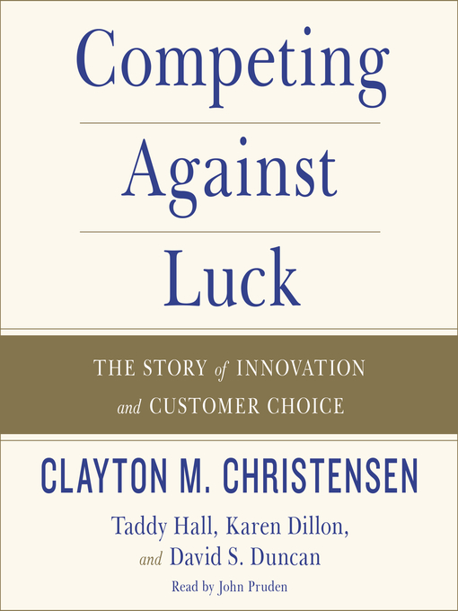

# Competing Against Luck

*Competing Against Luck* is a book by the late Harvard Business School professor on disruptive innovation Clayton M. Christensen. He challenges the way we typically see innovation and instead proposes that we empathize with users by thinking of the Jobs to Be Done rather than demographics or other arbitrary metrics. While some passages were repetitive, the case studies of Intuit, Amazon, and several other companies, and the end-of-chapter takeaways, were useful in illustrating this new way of thinking about customer needs.

This book was recommended by Kevin Wu for my internship at [Workpal-AI](https://workpal.ai/) in full-stack web development. Below is my outline:

---

- If a company doesn&#39;t understand why I choose a particular product, its data about me or people like me are unlikely to help it create any new innovations

- Patterns and cross-references in data sets do not imply causality

- Innovators tend to frame primary challenge around better product, more profitability, differentiation rather than cause behind why people purchase particular solution

**"If you do not know how to ask the right question, you discover nothing." - W. Edwards Deming**

**Better question:** What job did you hire that product to do?

## Theory of Jobs to be Done: 
Deeply understand your customers&#39; struggle for progress and create right solution and set of experiences to solve their jobs well, every time

#Chapter 1: The Milkshake Dilemma

&quot;Stupid manager&quot; hypothesis: DEC example - success and failure both attributed to company&#39;s management

- doesn&#39;t hold up as almost every minicomputer company collapsed at the same time

- Professional managers can do everything right and still fail due to disruptive innovation (being beaten by new entrants with cheaper and initially far inferior offerings)

## Disruptive Innovation
Innovation transforms existing market or sector by introducing simplicity, convenience, accessibility, and affordability where complication and high cost become status quo

- theory of competitive response to innovation

- still doesn&#39;t predict how company should innovate

Even if a company has intent to disrupt vulnerable incumbent, odds of creating exactly right service/product are < 25%

— How do successful companies know how to grow?

## Case study: **How to sell more milk shakes**

No change arose when asking consumers questions to improve milk shakes/pricing/product quality (chunkier, chocolatier, chewier)

**New approach:**&quot;I wonder what job arises in people&#39;s lives that causes them to come to this restaurant to &#39;hire&#39; a milk shake?&quot;

- Customers are not just buying a product, but hiring a milk shake to perform a specific _job_ in their lives

- Team watched restaurant for 18 hours one day: What time did people buy milk shakes? What were they wearing? Were they alone? Did they buy other food with it? Did they drink it in restaurant or drive off with it?

**Insights:** Most milk shakes sold before 9 am to people who came alone and only bought milk shake - got in car and drove off

Job: long and boring ride to work: not really hungry but needed something to keep commute interesting, and other competitors did not do job perfectly (ie. bananas, doughnuts, bagels, Snickers bar etc)

**Why milk shake?** Took long time to finish with thin straw, substantial enough to ward off looming midmorning hunger, fits in cup holder

- Milk shake buyers have nothing in common in terms of demographics but all wanted same job done

- Milk shakes purchased in afternoon and evening had completely different job: unhealthy snack to connect with children (not competing with other food items but rather stop at toy store or finding time for a game of catch later)

Implies there are at least 2 solutions for fast-food chains to sell more milk shakes

## Case study: **Margarine**

Unilever has 70% market share- how can it grow?

Basic benefits: lower fat content (considered healthier in past), cheaper than butter

- Differences only focus on one attribute: percentage of fat (irrelevant to job)

Competitors for hard chunks of fat like margarine: butter, cream cheese, olive oil, mayo, etc.

Competitors for not burning food when cooking: Teflon, nonstick cooking spray

- Customer holds in mind resume of competing products for which does the job best

Customer satisfaction metrics don&#39;t reveal how to do job better

Margarine surpassed by butter due to trans fats in 2000s, Unilever intends to separate spreads division into standalone company to stabilize sales while global olive oil is fastest-growing

**Jobs Theory and Innovation**

Failure to talk about innovation: analytics, data, frameworks, customer categories, performance metrics

**Jobs Theory:** helps understand _causal mechanism_ of customer behavior and as a result, fundamental driver of innovation success

## Example:  **Uber** - identified job to be done and performed extremely well in spite of staunch resistance from entrenched, government-backed competitors

- What job did Uber do? Recognize and nail unsatisfactorily filled job of urban transportation

**Why isn&#39;t Jobs Theory more used?**

1) Hard to identify and understand specific job

2) Translating insights into blueprint for product development involves creating right set of _experiences_ to accompany product/service

3) Ensuring company&#39;s internal capability and processes are done well consistently

**Competitive advantage:** creating right experiences + integrating them around job to solve

#Chapter 2: Progress, Not Products

## Example:  **Louis Pasteur**

- Success can be attributed to theory (germ theory) describing actual causal mechanisms of disease transfer

## Example:  **Car manufacturers in the 80s**

- Most cars were lemons (never worked properly): 30,000 individual parts, auto manufacturing lines received 2000 unique parts from suppliers from 17 countries =\&gt; inherent randomness in manufacturing, same way as we think about innovation

**Why is that no longer the case?** Because Japanese auto manufacturers experimented relentlessly to learn the _cause_ of manufacturing defects.

- Manufacturing errors rarely repeated, quality improved continuously, costs declined

- Possible to reliably and efficiently produce quality cars when you improve the _process_, despite inherent complexity

## Example: **Toyota rules**

- Employee must never add value to a part until it is ready to be used in next step

- Must be done in the same way, every time

- Each activity is individual if-then statement: &quot;If we do _this_, then _that_ will be the result&quot;

**Benefits** :

- Shows the value-adding step worked definitely in next step of process

- Creates environment of repeated scientific experimentation

Innovation exists in &quot;pre-quality revolution&quot; state

- Managers accept flaws, missteps, failure as inevitable part of process

- Accustomed to putting Band-Aids on uneven innovation success =\&gt; no longer know what causes it in first place

**Defining the Job**

**Job** : progress that a person is trying to make in a particular circumstance

- &quot;Progress&quot; represents _movement_ toward a goal or aspiration

- Resolve struggles, fulfill unmet aspirations

- ongoing and recurring, not discrete &quot;events&quot;

**Circumstance** : Specific context in which job arises

- 4 primary organizing principles of managers on innovation quest (product attributes, customer characteristics, trends, competitive response): insufficient and not predictive of customer behaviors

**Functional, Social, and Emotional Complexity** : Social and emotional dimensions outweigh functional

i.e. Childcare: functional dimension matters (safely take care of child in location and manner that works for lifestyle), but social and emotional are more important (&quot;Who will I trust with my children?&quot;)

**What isn&#39;t a job?** Needs = analogous to trends: directionally useful but insufficient

**Seeing the Job**

1. What progress is that person trying to achieve? (functional, social, emotional dimensions)

2. What are the circumstances of the struggle? (who, when, where, while doing what?)

3. What obstacles are getting in the way of the person making that progress?

4. Are consumers making do with imperfect solutions through some kind of compensating behavior?

5. How would they define what &quot;quality&quot; means for a better solution, and what tradeoffs are they willing to make?

Sometimes the job is not obvious.

## Example: **Airbnb** isn&#39;t competing against hotels, it&#39;s competing with staying with friends or not making a trip at all

We don&#39;t create jobs, we discover them.

Tradeoff: which benefits are essential and which are extraneous to a new offering?

Circumstance-specific hiring criteria:

## Example: Cigarette break

- Functional: Nicotine

- Emotional: Calm down and relax

- Social: Take work break and hang with others

Competes with **Facebook** : relax for a few minutes, virtual water-cooler with friends

## Example: **BMW**

**Job:** mobility

Constraints: Demand for green fuel-efficient cars (California banned combustion engines in near future), urbanization trends, fewer young people getting driver&#39;s license

-Rebranded from man&#39;s car to launching electric and hybrid BMWi line and DriveNow (pilot Zipcar-style sharing program)

- Shift from selling products to responding to jobs

**Limitations of Jobs Theory**

Not useful if there i snow struggle for consumer or existing solutions are good enough

Not useful when decision relies entirely on mathematical analysis (i.e commodities trading)

Cost or efficiency are not a core element of job

#Chapter 3: Jobs in the Wild

- Like scientific innovation, companies can get stuck in creating &quot;epicycles&quot;: elaborate approximations, estimations, and extrapolations

- Important to distinguish this from improving fundamentally flawed process vs. understanding causal mechanism

## Example: **SNHU** 

Online program for nontraditional students competed not only with other national online programs from traditional and for-profit colleges (Kaplan, ITT, University of Phoenix) but also _nothing_: non consumption

- Few existing policies, structures, and procedures set up to support job of online learners

- **Solution** : moved small online recruitment admin team 2 miles away to new office to grow unfettered by physical + structural limitations of traditional university policies and procedures, led session of 20 top faculty and admin to chart out entire admin process and eliminated hurdles

**Experiences customers sought to make progress:** no more leisurely responses to financial aid inquiries- follow up phone call came in under 10 minutes to close the sale

**Obstacles to be removed:** Decisions about prospect&#39;s financial aid package and how much previous college courses would count toward degree

**Social, emotional, and functional dimensions:** Online program completely reoriented to fulfill job for later-life learners- getting training to advance career (functional), pride of realizing goal or fulfilling commitment to loved one (emotional and social)

**Depth and Breadth of Application**

Nothing sounds less innovative than cheese company rolling out another type of cheese

## Case study:  **Sargento** cleared $50 million in year 1 of prepackaged ultra thin slices, and $150 million by year 2

**Job** : &quot;How can I enjoy all the delicious cheese experience that I love on my daily sandwich without the calories, fat, and guilt?&quot;

- Define offering in context of very specific consumer struggle

**Other examples:** International Delight Iced Coffee, Hershey&#39;s Reese&#39;s Minis, Tidy Cats Lightweights

**B2B Jobs**

## Example: **FranklinCovey** (1997 merger of Franklin Quest and Covey Leadership Center)

Not clear how products helped internal customers with priorities they cared about:

1) Driving customer loyalty

2) Delivering growth

**Challenge for people buying FranklinCovey products:** getting line leaders within company to recognize what they did in learning and development was critical

- HR &amp; learning professionals wanted to be acknowledged

Solution: repositioning all offerings around customers&#39; key Jobs to be Done

If CEO said priorities and goals didn&#39;t match particular courses, they would be fired

Revised model: selling subscriptions to provide customers to nearly unlimited access to course and content (courses, bite-sized learning modules, single-point lessons in range of modalities)

- Also sells entire _processes_ and experiences for particular JtBD (i.e. leadership execution, customer loyalty, sales performance)

Are there segments with distinct jobs that are inadequately served with one-size-fits-none solution?

# Chapter 4: Job Hunting

**Five ways to uncover jobs around you:**

1) Seeing jobs in your own life

2) Finding opportunity in nonconsumption

3) Identifying workarounds

4) Zoning in on things we _don&#39;t_ want to do

5) Spotting unusual uses of products

- A valuable source of insight is our own life

- Study people who are _not_ buying your product ( **nonconsumers** ): What is getting in their way to using your products to solve their problems?

- **Compensating behaviors** : workarounds to get a job done— clue that you stumbled on high-potential innovation opportunity

- Study _how_ customers use products in unusual and unexpected ways

# Chapter 5: How to Hear What Your Customers Don&#39;t Say

Customer has decision-making process about what to fire vs what to hire

**2 opposing forces battling for dominance:**

1) Forces compelling change to a new solution

2) Forces opposing change

A job has to have sufficient magnitude to cause people to change their behavior, but the pull of the new has to be much greater than the sum of the inertia of the old + anxieties of the new

The _how_ are ground-level, granular, extended narratives with a _sample size of one_

- **Storyboarding** what users really want reflect importance of combination of pushes + pulls that drive customers&#39; Big Hires and Little Hires

- Look for moments of struggle, nagging tradeoffs, imperfect experiences, and frustrations (recurring episodes where customers seek progress but are thwarted by limitations of current solution)

- Look for: surprises, unexpected behaviors, compensating habits, unusual product uses

A genuine insight is a thought that is experienced as true on conception = getting hired means understanding customer&#39;s narrative in such rich detail that you design a solution that far exceeds what the customer could have found words to request

Customers often can&#39;t articulate what they want = their actions tell a different story than what they describe

Seemingly objective customer behavior data focuses exclusively on **Big Hire** (when customer buys product) and neglects **Little Hire** (when customer actually uses it)

- Only consistent series of Little Hires can confirm product solves customer&#39;s job

What does a customer need to fire before hiring your product?

If forces opposing change are strong, you can innovate experiences to mitigate them (i.e. creating experiences to mitigate anxiety of moving something to new)

**Design thinking:** problem-solving methodology emphasizing deep empathy with customer, divergent thinking, and rapid iteration of solutions

- Prioritize users&#39; experiences over product attributes

#Chapter 6: Building Your Resumé

## Example: **American Doll:** 
Does better than competitors from Toys&quot;R&quot;Us, Walmart and Disney because of an experience (connection, empowering self-belief, chance to savor childhood longer)

- Books more popular than dolls themselves, initially only available through catalog, even experience of unboxing to find out doll&#39;s name

**Decoding the Complexity**

**What do I need to design, develop, and deliver in my new product offering so that it solves the customer&#39;s job well?**

- Capture relevant details of job in a job spec, functional, emotional, and social dimensions that define the desired progress, tradeoffs the customer is willing to make, the full set of competing solutions that must be beaten, obstacles and anxieties that must be overcome

- Offering should include plan to surmount obstacles and create right set of experiences in purchasing and using product

**Uncover the Job, Create the Desired Job, Integrate Around the Job**

**1) Uncovering the Job**

- A job is the progress an individual seeks in a given circumstance

- Every job has a functional, emotional, and social dimensions whose relative importance vary with content

**2) Creating the Desired Experiences**

- The experiences we enable in each of these three dimensions to fulfill the job

- These differentiating experiences in purchase and use comprise the criteria by which customers choose one competitor&#39;s product over another

**3) Integrating Around the Job**

- Aligning our internal processes with the job in order to provide the desired experience

- These processes, when aligned with the job, are difficult to copy and thus the source of competitive advantage

## Example: **Ikea**

- Shopping experience, store layout, design of the products, packaging all different than standard furniture store

**Job:**&quot;I&#39;ve got to get this place furnished tomorrow, because the next day I have to show up at work&quot;

- We are willing to pay _premium prices_ for a product that nails the job because the _full cost_ of a product that fails to do the job (wasted time, frustration, spending money on poor solutions) is significant to us

- The &quot;struggle&quot; is costly!

/!\ Sometimes customers pay for premium products because they are _interdependent_ with product they already hired (i.e. printer-ink cartridges, smartphone recharges/cases) = we give in because there isn&#39;t better solution yet + these products cause anxiety and resentment

**Removing the Obstacle**

Creating experiences and overcoming obstacles is how a product becomes a _service_ to a customer, rather than just a product with better features and benefits

What are the experiences that customers seek in not only purchasing, but also in using this product?

## Example: **Uber**

Social and emotional dimensions throughout through: who wants to have to outmaneuver pool schlubs on the same street corner trying to hail a cab? You don&#39;t want to either pay for a car service or be at its mercy when you&#39;re finally ready to come back and get you

- Push few buttons, 3-7 minutes specific person will pick you up, you can relax and wait, don&#39;t have to worry about having enough cash in wallet or fear swiping credit card into taxi machine

## Example: **Amazon**

- Customer reviews help customers make the progress they want to make

Allows users to shop unfamiliar categories with total confidence because other users who share job will gauge performance for me

- Amazon has Hall of Fame reviewers and top ten thousand reviewer rankings

- In 2015, Amazon introduced technology to automate giving more weight to newer reviews, reviews from verified Amazon purchasers, and reviews that more customers voted as being helpful

**Job:**&quot;I don&#39;t want the hassle of having to return it or just consider it wasted money. And I don&#39;t want to wait two days to find out I still need another solution. How can I be sure I&#39;m not making a mistake?&quot;

**Businesses now have to consider how to educate customers about what jobs these products and services are designed to do— and when potential customers should** _ **not** _ **consider hiring them**

**Purpose Brand**

Done perfectly, your brand can become synonymous with the job

## Examples: Uber, TurboTax, Disney, Mayo Clinic, OnStar, Harvard, Match.com, OpenTable, LinkedIn

- **Purpose brands** externally communicate how &quot;enclosed attributes&quot; deliver complete and specific experience

Purpose brands built with minimal advertising at outset: Starbucks, Google, craigslist.org

- Each is associated with a clear purpose optimized around a clear Job to be Done

**Category placeholders** : Brands that fail to integrate around job risk (i.e. airlines, automakers, business hotel chains, rental-car companies, PC-clone manufacturers)

- Purpose brands create enormous opportunities for differentiation, premium pricing, and growth

#Chapter 7: Integrating Around a Job

## Example:  **Mayo Clinic:**

- **Job** : Organized around specialties of doctors, but really, main organizing principle is _process_ to get the right things in right sequence

**Processes:** What information do we need to have in order to decide what to do next? Who is responsible for each step? What do we prioritize over other things?

- hard to see: intangible, emerge from hundreds of small decisions, belong to company

- can&#39;t be easily copied

- Resources are fungible (can be bought and sold), products easily copied— integrating processes creates ideal experiences + confers competitive advantages

- Traditional hospitals = primary care physician coordinates care but has no deliberate _process_ (ad hoc), can take months

W. Edward Demmings: &quot;If you can&#39;t describe what you are doing as a process, then you don&#39;t know what you are doing.&quot;

## Example: **Toyota**

- Twice a month allows rival auto executives and engineers into manufacturing complex

- **Competitive advantage:** proprietary, complex, unspoken processes (not worried to give away &quot;secret sauce&quot;)

## Example: **SNHU**

- Used to track &quot;cost&quot; of acquiring prospective student (low), now tracks response time in minutes (under 10) and ability for transfer credit determination

- Nothing about this ratio tells university _why_ number is good or bad

- Prospective students talk to someone instead of finding big white envelope nestled among junk

**Job to be Done:** systematically _removing_ complexity and frustrations from prospective student (i.e. financial aid process, hunting down transcripts)

**Reorgs**

**Bain 2010 Study:** Fewer than 1/3 of major reorgs delivered _any_ material improvement and many destroyed value

- Managers in charge of major function or set of activities, executives in charge of product

- Nobody in charge of understanding and ensuring company delivers on job of a customer (how different parts of the org interact to systematically deliver)

## Example: **Consumer Financial Protection Bureau (CFPB)**

- Assembled groups with occasionally conflicting missions like enforcement and supervision

- Ensured views were aligned around job

**Job** : preventing future consumer financial issues and restitution of past ones

## Example: **Intuit**

Rolling out trial for new version of QuickBooks for small version

- Decided against forcing customer to call

**Measuring Job to be Done** :

1) How much time did we save this customer?

2) Did we allow them to _not_ spend time doing something they didn&#39;t want to do?

3) Did we improve their cash flow?

4) Are our processes supporting the things customers are hiring us to do?

## Example: **Amazon**

**Measures:**
1. vast selection
2. low prices
3. fast delivery

	+ on minute-to-minute basis
	+ new innovations famously start with mock "press release"

## Case study: **General Motors OnStar**

- Generated $2.5 billion in revenue and $500 million in net profit for GM with _negative_ net assets

- Initial goal was &quot;coolest brochure ever&quot;

- **Insights:**

- People didn&#39;t really need the concierge at all

- Unexpected customer base: Chevy drivers (budget-conscious segment)

- Directions are much more about unfamiliar locations than finding good restaurant

**Job:** Providing peace of mind while you&#39;re driving

**Differentiator:** Continual upgrade of technology installed inc are

- Automotive life cycle takes 3-5 years, but wireless product development is shorter

- Had to validate mechanisms for all different kinds of vehicles

**Stack Fallacy** : Highlights the tendency of engineers to overweight value of own technology and underweight downstream application of that technology to solve customer problem and enable desired progress

- Mistaken belief that it is trivial to build the layer above yours

#Chapter 8: Keeping Your Eye on the Job

**The Three Fallacies of Innovation**

1) The Fallacy of Active vs. Passive Data

2) The Fallacy of Surface Growth

3) The Fallacy of Conforming Data

**Ted Levitt&#39;s adage:** Customers want a quarter-inch hole, not a quarter-inch drill

### **The Fallacy of Active vs. Passive Data**

Railroads were in trouble because they assumed themselves to be in railroad business, not transportation business

- Let product define market they were in, rather than job customers hired them to do

**Passive data** : Information needed to make decisions about solving for a job found in context of struggle

- No voice or clear structure or champion or agenda

- Unfiltered context

**Switch from passive to active data:**

1) Product sales generate _data about products_

2) Customers&#39; purchases generate _data about customers_

3) Investments in people, facilities, tech generate _data on productivity, returns, returns, value_

4) Competitors emerge, leading investors and managers create _benchmarks that make data_

- Data about operations: make it easy for managers to manage numbers instead of the job

### **The Fallacy of Surface Growth**

**Surface growth** : allure of selling more products to existing customers

- Companies end up trying to make many products for many customers, lose focus

- Sunk costs in investments in production capabilities, intellectual property, and talent

- Pressure to &quot;sweat the assets&quot; and &quot;what have you done for me&quot; shareholders

## Example: **New York Times**

2 customers that matter:

1) Readers

2) Advertisers

- NYT tries to do more and more jobs for same set of customers (help readers unwind, provide up-to-date news, help readers become informed, fill their time productively)

Each additional job it solves has a competitor who only focuses on that job

### **The Fallacy of Conforming Data**

- Data conforms itself to support whatever point of view we want

Gerald Zaltman: &quot;Decisions don&#39;t get made. They happen.&quot;

- Common when research is used to prove points rather than as fuel for imaginative insight

- Many view numerical data as more trustworthy than qualitative data

- Primary function of data is to represent the phenomena- create simulation of reality

**Misconception** : only quantitative data is _objective_

- All data is man-made

**Passive data needs active management**

# Chapter 9: The Job-Focused Organization

**Feature chase:** Look at what customers were asking for and build it

- No ability to differentiate which features were the right ones

## Example: **TurboTax**

- Customer&#39;s weren&#39;t hiring to provide better tax interview tool

- They didn&#39;t want to have to work through interview at all!

- Don&#39;t want data inputs. Just want TurboTax to get taxes done

- Preloading data (i.e. payroll) in just one &quot;chapter&quot; actually _led_ to uptick in interview completion

**How can a leader constantly rally his team about a challenging goal— and keep them focused?**

- Operates like a &quot;network of start-ups&quot;

- Small teams launch new product pilots with minimal senior-level approval once aligned with jobs

**Four Clear Benefits:**

1) Enable distributed decision making with clarity of purpose

2) Align resources against what matters most

3) Inspire people and unify culture in service of what they care about most

4) Measure what matters most— customer progress, employee contributions, incentives

## Example: **Unilever**

**Lifebuoy** : Color-changing soap that keeps children washing their hands long enough to kill germs

- **OnStar** : Picked and choosing among cool bells and whistles and creating technical offer at first

- Optimized around Job, spent less time and energy evaluating options

- Focus greatly simplifies

**Two-sided Compass** : Deeper understanding of job leads to better job spec

- Create structures by which people make right choices without being asked

&quot;Improving customer&#39;s lives&quot; is not a single data-point

## Example : **Amazon**

Delays, accidents, poor performance = defects to be eradicated

Shopping robot = automated search engine that scours prices of hundreds of benchmark products a day

- Prices automatically lowered to beat competitors

- Dropping below appropriate gross-margin threshold triggers human review

- Designed for efficiently delivering on job customers are hiring for

## Example: **Desert News Publishing Company**

- Newspapers historically hired to address four or five distinct jobs

- Classified ads: help me find employment, help me find low-cost item to buy this weekend

- Opinion columns: find someone who supports or clarifies my view

- Prior to Internet: Tell me what is happening right now in my community

- **Jobs-based segmentation:**&quot;I want to be well-informed, feel more confident in my knowledge, and still be true to my beliefs so that I can make a difference in my home and community&quot;

- **Target audience:** tolerant believers, devoted denominationists, strugglers

Like-minded believers made up nearly 56% of American news consumers yet felt massively underserved

**- Functional: PICA:** Perspective, Insight, Context, Analysis

- **Emotional:** Help readers connect issues to deeper interests around family and faith