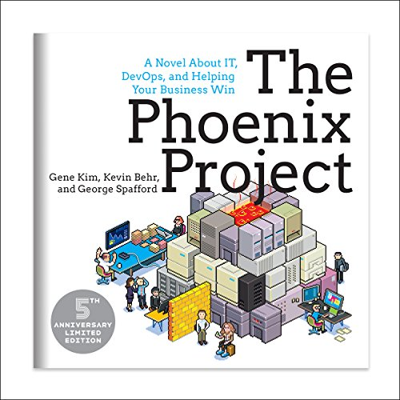

# The Phoenix Project

*The Phoenix Project* was recommended to me by [Chris Kelly](https://ckdake.com/books.html) and Ben Sheldon, two mentors I met through [Out of Office Hours](https://www.outofofficehours.com/) on the same week! Naturally, this piqued my curiosity and made me want to read the book even more. As it turns out, it is a novel that contains gems on Devops, IT operations, product management, and information security all in one. 

While books like *The Lean Startup* and *The Toyota Way* explain the iterative model that can be gleaned from Japanese manufacturing, seeing this process applied to software through the lens of the sometimes eccentric but always overwhelmed workers of Parts Unlimited was an entertaining and daunting exercise for the reader! 

While parts of the book felt like the characters could be interchangeable in delivering a fundamental business lesson, I still felt I learned a lot about how departments can prevent dysfunctional communication and successfully collaborate with one another towards a common goals. Fellow fans of cult office comedies revolving around workplace bureaucracies like *Office Space* (1999) or *The IT Crowd* (2006-2013) will love this book.

## Summary

The start of the novel opens with Bill, who dreads his recent promotion to VP of IT Operations, a position which is always rapidly vacated along with CIO. A payroll glitch which threatens to erase salaries, violate labor laws, exacerbate an ongoing audit, and create terrible press after massive losses in recent quarters takes Bill down the rabbit hole of fixing multiple departments across the entire organization. After the payroll issue, Bill must tackle Sev 1 outages, unplanned work, technical debt, deployment problems, and more or risk having the Board spin off the company and lay off the entire IT department. 

By slowly enlisting the trust of Patty, the hyper-organized Director of IT Support, and Wes, the grumpy Director of Distributed Technology Operations, he takes on the momentous task of creating processes and systems through kanban boards and katas. The trio must do all of this with minimal guidance from Board Member and aloof management guru Erik, while avoiding being thwarted by Sarah, the obsequious SVP of Retail Operations who steals bottleneck resource Brent-- the only 10x programmer who seems to know what's going on.

## Lessons Learned

1. What is **Devops**? 

Routinely deploying hundreds or thousands of production changes per day, while preserving world-class reliability, stability, and security.

2. What are the benefits?
	+ Faster feature time to market
	+ Increased customer satisfaction
	+ Twice as likely to exceed profitability, market share, and productivity goals
	+ Win in marketplace through dominant value creation and customer acquisition

3. Spending 20% time ensuring work flows smoothly through the entire value stream through faster automated tests, improved deployment infrastructure, and useful production telemetry prevents upstream groups causing chaos.
	+ Fast feedback loops prevent bad production code and enable faster deployment, so that any problems are quickly detected and corrected.

4. **Nonfunctional requirements** (quality, scalability, manageability, security, operability) are just as important as achieving business objectives.

5. *Catch-22*: 1980s manufacturing saw a conflict arise between 1) protecting sales commitments and 2) controlling manufacturing costs. The product sales force wanted lots of inventory so customers could always get products, but plant managers wanted to reduce inventory and **work in progress (WIP)** to reduce costs.
	+ This was resolved using **Lean principles**:
		* Reducing batch sizes
		* Reducing WIP
		* Shortening and aplifying feedback loops

### The Three Ways
Values and philosophies that guide DevOps processes and practices:

> **The First Way**: Left-to-right flow of work from Development to IT Ops to customers

**Practices:** continuous build, integration, deployment, creating environments on demand, limiting work in process, building safe systems & organizations that are safe to change

- Small batch sizes and intervals of work
- Never passing defects downstream
- Constantly optimizing for global goals

> **The Second Way**: Constant flow of fast feedback from right-to-left at all stages of value stream

**Practices:** stopping the production line when builds and tests fail in deployment pipeline, create fast automated test suites, create shared goals and pains between Dev and IT Ops, create production telemetry so everyone can see whether code and environments operate as designed

- Prevent problems from happening again or enable faster detection and recovery
- Create quality at the source by creating or embedding knowledge where we need it

> **The Third Way**: Create a culture that fosters continual experimentation & repetition and practice

**Practices:** creating a culture of innovation and risk-taking (as opposed to fear or mindless order taking) and high trust (as opposed to low trust, command-and-control), allocate min 20% of Dev and IT Op cycles toward non-functional requirements

- Experimentation and risk-taking enable relentless improvements to systems of work
- When things go wrong, constant repetition and daily practice allows us to retreat to place of safety and resume normal operations

## The Four Types of Work
1. **Business Projects:** Business initiatives (most Development projects), reside in Project Management Office to track all official projects in org
2. **Internal IT Projects:** Include infrastructure of IT Ops projects that business projects create and internally generated improvement projects (create new environment, automate deployment), reside with budget owners (DB manager, storage manager, distributed systems manager)
3. **Changes:** Generated from previous two types of work and are tracked in ticketing system (Remedy for IT Ops, JIRA or Agile planning tool for Development)
4. **Unplanned work or recovery work:** Operational incidents and problems caused by previous types of work at expense of other planned commitments

> ### Agile means you not only have shippable code, but a working environment it can deploy into.

> ### DevOps is the manufacturing revolution of our age.

> ### Pay down technical debt!

# Recommended Books:
- The Goal: A Process of Ongoing Improvement, by Eliyahu Goldblatt
- The Five Dysfunctions of A Team: A Leadership Fable, by Patrick Lencioni
- Toyota Kata: Managing People for Improvement, Adaptiveness and Superior Results, by Mike Rother
- Continuous Delivery: Reliable Software Releases through Build, Test, and Deployment Automation, by David Farley and Jez Humble
- Release It!: Design and Deploy Production-Ready Software, by Michael T. Nygard
- Visible Ops and ITIL Service Support, by Kevin Behr and Gene Kim
- Personal Kanban: Mapping Work | Navigating Life, by Jim Benson and Tonianne DeMaria Barry
- Getting Things Done: The Art of Stress-Free Productivity, by David Allen

